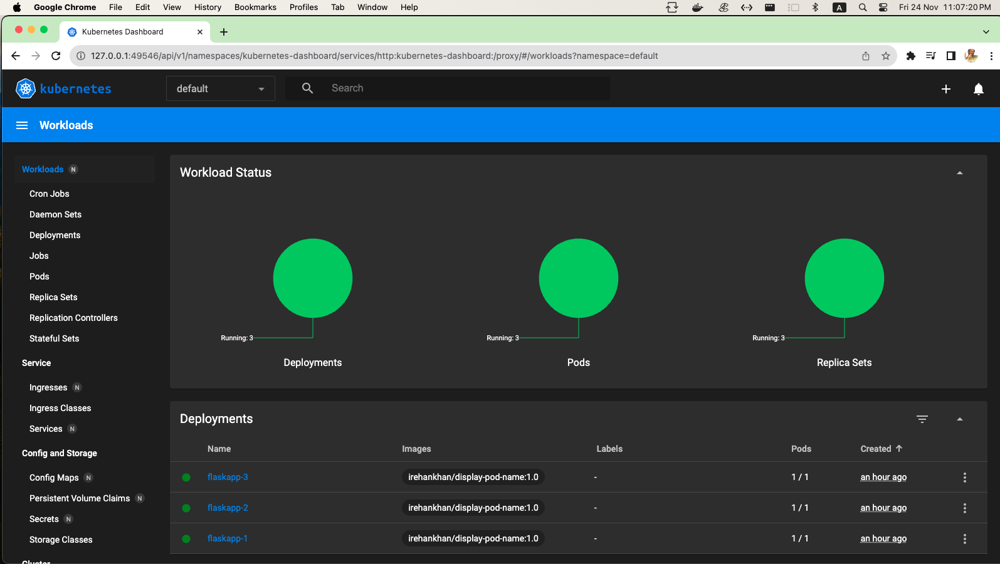
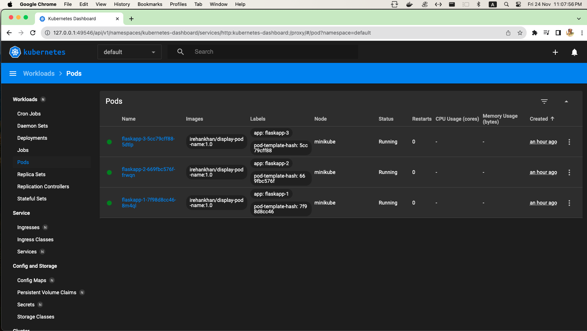
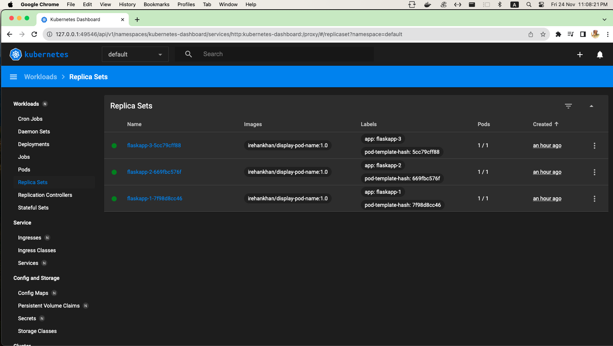
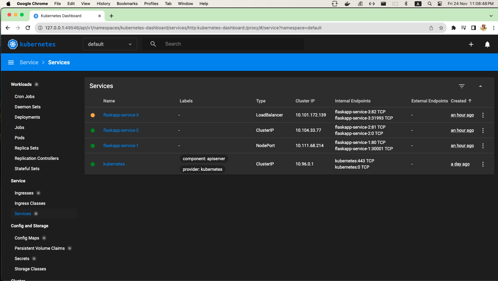
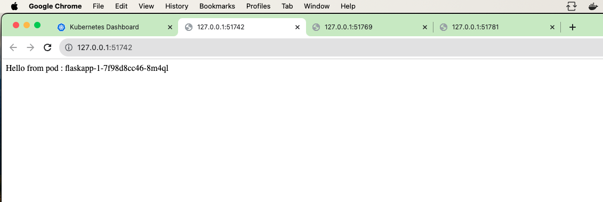
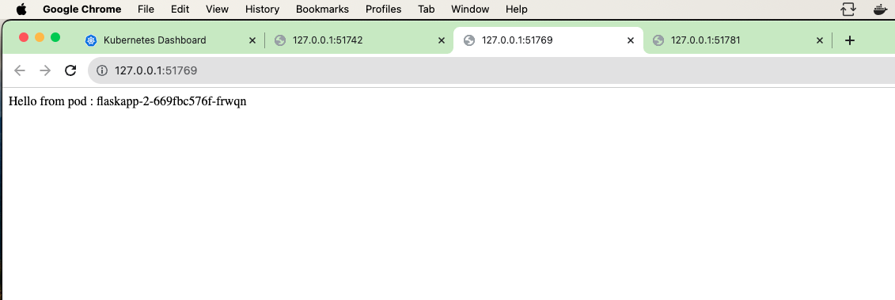
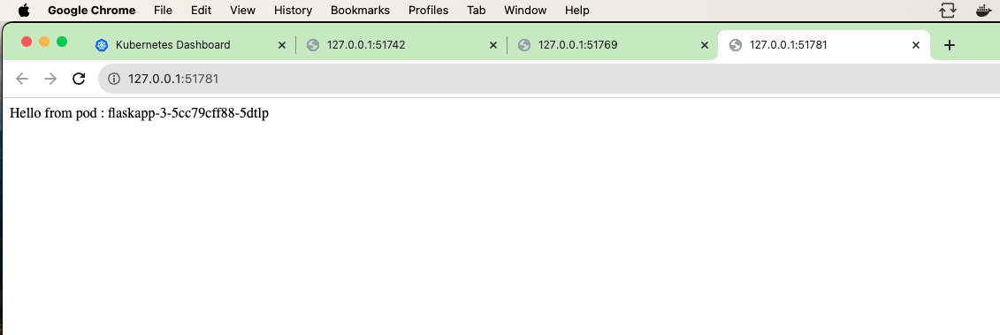

# Minikube, deployments, and services in Kubernetes

## Minikube Installation

Below command used in terminal to install minikube and kubectl on MacOS arm64 
```bash
brew install minikube
```
After Installation below command is used in terminal to start minikube with kubectl
```bash
minikube start
```
```bash
irehankhan@Rehans-Mac-mini pod-name % minikube start
😄  minikube v1.32.0 on Darwin 14.1.1 (arm64)
✨  Using the docker driver based on existing profile
👍  Starting control plane node minikube in cluster minikube
🚜  Pulling base image ...
🏃  Updating the running docker "minikube" container ...
🐳  Preparing Kubernetes v1.28.3 on Docker 24.0.7 ...
🔎  Verifying Kubernetes components...
    ▪ Using image gcr.io/k8s-minikube/storage-provisioner:v5
    ▪ Using image docker.io/kubernetesui/dashboard:v2.7.0
    ▪ Using image docker.io/kubernetesui/metrics-scraper:v1.0.8
💡  Some dashboard features require the metrics-server addon. To enable all features please run:

	minikube addons enable metrics-server	


🌟  Enabled addons: storage-provisioner, default-storageclass, dashboard
🏄  Done! kubectl is now configured to use "minikube" cluster and "default" namespace by default
```
For Checking Minikube & Kubectl `version` for confirmation using below commands
```bash
irehankhan@Rehans-Mac-mini pod-name % minikube version
minikube version: v1.32.0
commit: 8220a6eb95f0a4d75f7f2d7b14cef975f050512d
irehankhan@Rehans-Mac-mini pod-name % kubectl version
Client Version: v1.28.4
Kustomize Version: v5.0.4-0.20230601165947-6ce0bf390ce3
Server Version: v1.28.3
```
## Display Pod Names

Below code is a simple Flask application in Python. This application utilizes Flask to create a web server with a single route ("/") that, when accessed, returns a message containing the name of the pod.

Here's a detailed breakdown of the code:

1. Import Flask and Socket Modules:
```python
from flask import Flask
import socket
```
2. Create Flask Application:
```python
app = Flask(__name__)
```
3. Define Route and Handling Function:
```python
@app.route('/')
def hello():
    pod_name = socket.gethostname()
    return f'Hello from pod: {pod_name}'
```
4. Check for Direct Execution:
```python
if __name__ == '__main__':
    app.run(debug=True, host='0.0.0.0', port=5000)
```
5. Run the Flask Application:
```python
app.run(debug=True, host='0.0.0.0', port=5000)
```
This code initializes a Flask web application, defines a route for the root URL ("/"), and, upon accessing this URL, returns a greeting along with the name of the pod (machine). The application runs on the Flask development server with debugging enabled, listening on all public IPs on port 5000.

To execute this application, run the script, and the Flask development server will start. Access the application by navigating to http://127.0.0.1:5000/ in a web browser.

## Dockerfile

```Dockerfile
# Use a base image with Python
FROM python:3.8-slim

# Set the working directory
WORKDIR /app

# Copy the application files to the container
COPY . /app

# Install dependencies
RUN pip install --no-cache-dir -r requirements.txt
RUN pip install --upgrade pip

# Set environment variables
ENV FLASK_APP=app.py

# Expose the port on which your Flask app runs
# EXPOSE 5000

# Define the command to run your application
CMD ["python", "app.py"]
```
Above Dockerfile sets up a Docker image for a Python application, likely a Flask web application. Let me explain each section:

1. Base Image: FROM python:3.8-slim
This line specifies the base image for your Docker image. In this case, it's using the official Python 3.8 image with a slim variant, which means it contains only essential packages.
2. Working Directory: WORKDIR /app
This line sets the working directory inside the container to /app. Subsequent commands will be executed in this directory.
3. Copy Application Files: COPY . /app
This line copies all the files from the host machine's current directory (where the Dockerfile is located) to the /app directory inside the container.
4. Install Dependencies:
```Dockerfile
RUN pip install --no-cache-dir -r requirements.txt
RUN pip install --upgrade pip
```
These lines install the Python dependencies specified in the requirements.txt file using pip. The --no-cache-dir flag is used to prevent caching of the installation files.
5. Set Environment Variables: ENV FLASK_APP=app.py
 - This line sets an environment variable FLASK_APP to app.py. This is likely used by Flask to determine the entry point of the application.
6. Expose Port (commented out): # EXPOSE 5000
 - This line is commented out (#) which means it's not effective. It would expose port 5000 on the container, but exposing ports in the Dockerfile is generally not necessary. Port exposure is typically done when running the container with the -p flag.
7. Command to Run Application: CMD ["python", "app.py"]
 - This line specifies the default command to run when the container starts. In this case, it's running the app.py file using the python command.

Overall, this Dockerfile is set up to create an image for our application.

Then we will create `requirement.txt` file for flask installation.

After that we will build image using below command then push it to docker hub.

```bash
docker build -t irehankhan/display-pod-name:1.0 .
docker login
docker push irehankhan/display-pod-name:1.0
```
Logs
```bash
irehankhan@Rehans-Mac-mini pod-name % docker build -t irehankhan/display-pod-name:1.0 .
[+] Building 25.6s (11/11) FINISHED                                                                           docker:desktop-linux
 => [internal] load .dockerignore                                                                                             0.0s
 => => transferring context: 2B                                                                                               0.0s
 => [internal] load build definition from Dockerfile                                                                          0.0s
 => => transferring dockerfile: 516B                                                                                          0.0s
 => [internal] load metadata for docker.io/library/python:3.8-slim                                                            3.1s
 => [auth] library/python:pull token for registry-1.docker.io                                                                 0.0s
 => [1/5] FROM docker.io/library/python:3.8-slim@sha256:19e07fa24813e88b04e606772213bd03ba044637cc939a211e28ccf997a9162a      0.0s
 => [internal] load build context                                                                                             0.0s
 => => transferring context: 8.98kB                                                                                           0.0s
 => CACHED [2/5] WORKDIR /app                                                                                                 0.0s
 => [3/5] COPY . /app                                                                                                         0.0s
 => [4/5] RUN pip install --no-cache-dir -r requirements.txt                                                                 18.5s
 => [5/5] RUN pip install --upgrade pip                                                                                       3.9s
 => exporting to image                                                                                                        0.1s 
 => => exporting layers                                                                                                       0.1s 
 => => writing image sha256:bf2770624bda9cfa5d1dd4abe28fec32e7cf589f9907638db560c8e4f29e9a0c                                  0.0s 
 => => naming to docker.io/irehankhan/display-pod-name:1.0                                                                    0.0s 
                                                                                                                                   
What's Next?                                                                                                                       
  View a summary of image vulnerabilities and recommendations → docker scout quickview
irehankhan@Rehans-Mac-mini pod-name % docker login                                     
Authenticating with existing credentials...
Login Succeeded
irehankhan@Rehans-Mac-mini pod-name % docker push irehankhan/display-pod-name:1.0      
The push refers to repository [docker.io/irehankhan/display-pod-name]
6539b047ecc9: Pushed 
1e81dd2e3599: Pushed 
317eece44f8a: Pushed 
ecd995c99fb1: Layer already exists 
761e5653e619: Layer already exists 
c3b370a9a96e: Layer already exists 
376be47dbc4e: Layer already exists 
fd9381859d11: Layer already exists 
f4e4d9391e13: Layer already exists 
1.0: digest: sha256:d3223d4c1caf33f5b07f73a1fbecea9acd29c66705fcf735a491381a87bb41d9 size: 2206
```
## Deployment

Now we will create kubernetes deployments files for three deployments for displaying there pod name.

### deployment-1.yaml file


```yaml
apiVersion: apps/v1
kind: Deployment
metadata:
  name: flaskapp-1
spec:
  replicas: 1
  selector:
    matchLabels:
      app: flaskapp-1
  template:
    metadata:
      labels:
        app: flaskapp-1
    spec:
      containers:
      - name: flask-app
        image: irehankhan/display-pod-name:1.0
        ports:
        - containerPort: 5000
          protocol: TCP
        resources:
          limits:
            cpu: 1000m
            memory: 1Gi
          requests:
            cpu: 1000m
            memory: 1Gi
        env:
        - name: FLASK_ENV
          value: development
        - name: POD_NAME
          valueFrom:
            fieldRef:
              fieldPath: metadata.name  # Get the pod name from metadata
```
- apiVersion: Specifies the API version for this Kubernetes resource (apps/v1 for Deployment).
- kind: Specifies the type of resource (Deployment).
- metadata: Contains metadata for the Deployment, including the name.
- spec: Defines the desired state for the Deployment.
  - replicas: Specifies the number of replicas (pods) to run (1 in this case).
  - selector: Specifies how the Deployment finds which pods to manage.
 - template: Defines the pod template.
   - metadata: Labels for the pod.
   - spec: Defines the pod's specification.
     - containers: Specifies the containers in the pod.
       - name: Name of the container.
       - image: Docker image to use.
       - ports: Specifies the container port to expose (5000 in this case).
       - resources: Specifies resource constraints for the container (CPU and memory limits and requests).
       - env: Specifies environment variables for the container.
```yaml
apiVersion: v1
kind: Service

metadata:
  name: flaskapp-service-1

spec:
  selector:
    app: flaskapp-1

  ports:
    - protocol: TCP
      port: 80
      targetPort: 5000
      nodePort: 30001
  type: NodePort
```
- apiVersion: Specifies the API version for this Kubernetes resource (v1 for Service).
- kind: Specifies the type of resource (Service).
- metadata: Contains metadata for the Service, including the name.
- spec: Defines the desired state for the Service.
  - selector: Selects which pods will be exposed by this service.
  - ports: Specifies how the service should forward traffic to the pods.
     - port: Port on the service.
     - targetPort: Port on the pods.
     - nodePort: Opens a specific port on all nodes in the cluster (accessible externally in a NodePort service).
     - type: Specifies the type of service (NodePort in this case).

This configuration is creating a single replica of a Flask application container, exposing it on port 5000 internally and on port 30001 externally (NodePort). The service is set up to route traffic to the pods based on the selector. The environment variables FLASK_ENV and POD_NAME are also set for the Flask application within the pod.

### deployment-2.yaml file

```yaml
apiVersion: apps/v1
kind: Deployment
metadata:
  name: flaskapp-2
spec:
  replicas: 1
  selector:
    matchLabels:
      app: flaskapp-2
  template:
    metadata:
      labels:
        app: flaskapp-2
    spec:
      containers:
      - name: flask-app
        image: irehankhan/display-pod-name:1.0
        ports:
        - containerPort: 5000
        resources:
          limits:
            cpu: 1000m
            memory: 1Gi
          requests:
            cpu: 1000m
            memory: 1Gi
        env:
        - name: FLASK_ENV
          value: development
        - name: POD_NAME
          valueFrom:
            fieldRef:
              fieldPath: metadata.name  # Get the pod name from metadata
      restartPolicy: Always

```
```yaml
apiVersion: v1
kind: Service

metadata:
  name: flaskapp-service-2

spec:
  selector:
    app: flaskapp-2

  ports:
    - protocol: TCP
      port: 81
      targetPort: 5000
  type: ClusterIP

```
- apiVersion: Specifies the API version for this Kubernetes resource (v1 for Service).
- kind: Specifies the type of resource (Service).
- metadata: Contains metadata for the Service, including the name.
- spec: Defines the desired state for the Service.
  - selector: Selects which pods will be exposed by this service.
  - ports: Specifies how the service should forward traffic to the pods.
    - port: Port on the service.
    - targetPort: Port on the pods.
- type: Specifies the type of service (ClusterIP in this case).

This configuration is creating a single replica of a Flask application container, exposing it on port 5000 internally, and the service is set up to route traffic to the pods based on the selector. The environment variables FLASK_ENV and POD_NAME are also set for the Flask application within the pod. The service type is ClusterIP, which means it's an internal service accessible only within the cluster.

### deployment-3.yaml file
```yaml
apiVersion: apps/v1
kind: Deployment
metadata:
  name: flaskapp-3
spec:
  replicas: 1
  selector:
    matchLabels:
      app: flaskapp-3
  template:
    metadata:
      labels:
        app: flaskapp-3
    spec:
      containers:
      - name: flask-app
        image: irehankhan/display-pod-name:1.0
        ports:
        - containerPort: 5000
        resources:
          limits:
            cpu: 1000m
            memory: 1Gi
          requests:
            cpu: 1000m
            memory: 1Gi
        env:
        - name: FLASK_ENV
          value: development
        - name: POD_NAME
          valueFrom:
            fieldRef:
              fieldPath: metadata.name  # Get the pod name from metadata
      restartPolicy: Always
```
```yaml
apiVersion: v1
kind: Service

metadata:
  name: flaskapp-service-3

spec:
  selector:
    app: flaskapp-3


  ports:
    - protocol: TCP
      port: 82
      targetPort: 5000
  type: LoadBalancer
```
- apiVersion: Specifies the API version for this Kubernetes resource (v1 for Service).
- kind: Specifies the type of resource (Service).
- metadata: Contains metadata for the Service, including the name.
- spec: Defines the desired state for the Service.
  - selector: Selects which pods will be exposed by this service.
  - ports: Specifies how the service should forward traffic to the pods.
    - port: Port on the service.
    - targetPort: Port on the pods.
  - type: Specifies the type of service (LoadBalancer in this case).

This configuration is creating a single replica of a Flask application container, exposing it on port 5000 internally, and the service is set up to route traffic to the pods based on the selector. The service type is LoadBalancer, which means it will provision an external load balancer to route traffic to the pods. This is useful when you want to expose your application to the external world.

## Applying Deployments

Below command are used to apply all deployments

```bash
kubectl apply -f deployment-1.yaml  
kubectl apply -f deployment-2.yaml  
kubectl apply -f deployment-3.yaml  
```
You can check below logs for deployments and pods and services creation for confirmation. Also from minikube dashboard screenshots are attached below.

Logs

```bash
irehankhan@Rehans-Mac-mini pod-name % kubectl get deployments                                                   
NAME         READY   UP-TO-DATE   AVAILABLE   AGE
flaskapp-1   1/1     1            1           112m
flaskapp-2   1/1     1            1           112m
flaskapp-3   1/1     1            1           112m
irehankhan@Rehans-Mac-mini pod-name % kubectl get pods                                                          
NAME                          READY   STATUS    RESTARTS   AGE
flaskapp-1-7f98d8cc46-8m4ql   1/1     Running   0          112m
flaskapp-2-669fbc576f-frwqn   1/1     Running   0          112m
flaskapp-3-5cc79cff88-5dtlp   1/1     Running   0          112m
irehankhan@Rehans-Mac-mini pod-name % kubectl get services                                                      
NAME                 TYPE           CLUSTER-IP       EXTERNAL-IP   PORT(S)        AGE
flaskapp-service-1   NodePort       10.111.68.214    <none>        80:30001/TCP   112m
flaskapp-service-2   ClusterIP      10.104.33.77     <none>        81/TCP         112m
flaskapp-service-3   LoadBalancer   10.101.172.139   <pending>     82:31993/TCP   112m
kubernetes           ClusterIP      10.96.0.1        <none>        443/TCP        27h
```








## Running Services

For running deployment services we use below commands

flaskapp-service-1

Command used 

`minikube service flaskapp-service-1`

```bash
irehankhan@Rehans-Mac-mini pod-name % kubectl get services                                                      
NAME                 TYPE           CLUSTER-IP       EXTERNAL-IP   PORT(S)        AGE
flaskapp-service-1   NodePort       10.111.68.214    <none>        80:30001/TCP   112m
flaskapp-service-2   ClusterIP      10.104.33.77     <none>        81/TCP         112m
flaskapp-service-3   LoadBalancer   10.101.172.139   <pending>     82:31993/TCP   112m
kubernetes           ClusterIP      10.96.0.1        <none>        443/TCP        27h
irehankhan@Rehans-Mac-mini pod-name % minikube service flaskapp-service-1
|-----------|--------------------|-------------|---------------------------|
| NAMESPACE |        NAME        | TARGET PORT |            URL            |
|-----------|--------------------|-------------|---------------------------|
| default   | flaskapp-service-1 |          80 | http://192.168.49.2:30001 |
|-----------|--------------------|-------------|---------------------------|
🏃  Starting tunnel for service flaskapp-service-1.
|-----------|--------------------|-------------|------------------------|
| NAMESPACE |        NAME        | TARGET PORT |          URL           |
|-----------|--------------------|-------------|------------------------|
| default   | flaskapp-service-1 |             | http://127.0.0.1:51742 |
|-----------|--------------------|-------------|------------------------|
🎉  Opening service default/flaskapp-service-1 in default browser...
❗  Because you are using a Docker driver on darwin, the terminal needs to be open to run it.
```
Result

You can check in below screenshot pod names on ips



flaskapp-service-2

Command used 

`minikube service flaskapp-service-2`

```bash
irehankhan@Rehans-Mac-mini pod-name % minikube service flaskapp-service-2 

|-----------|--------------------|-------------|--------------|
| NAMESPACE |        NAME        | TARGET PORT |     URL      |
|-----------|--------------------|-------------|--------------|
| default   | flaskapp-service-2 |             | No node port |
|-----------|--------------------|-------------|--------------|
😿  service default/flaskapp-service-2 has no node port
🏃  Starting tunnel for service flaskapp-service-2.
|-----------|--------------------|-------------|------------------------|
| NAMESPACE |        NAME        | TARGET PORT |          URL           |
|-----------|--------------------|-------------|------------------------|
| default   | flaskapp-service-2 |             | http://127.0.0.1:51769 |
|-----------|--------------------|-------------|------------------------|
🎉  Opening service default/flaskapp-service-2 in default browser...
❗  Because you are using a Docker driver on darwin, the terminal needs to be open to run it.
```
Result

You can check in below screenshot pod names on ips



flaskapp-service-3

Command used 

`minikube service flaskapp-service-3`

```bash
irehankhan@Rehans-Mac-mini pod-name % minikube service flaskapp-service-3 
|-----------|--------------------|-------------|---------------------------|
| NAMESPACE |        NAME        | TARGET PORT |            URL            |
|-----------|--------------------|-------------|---------------------------|
| default   | flaskapp-service-3 |          82 | http://192.168.49.2:31993 |
|-----------|--------------------|-------------|---------------------------|
🏃  Starting tunnel for service flaskapp-service-3.
|-----------|--------------------|-------------|------------------------|
| NAMESPACE |        NAME        | TARGET PORT |          URL           |
|-----------|--------------------|-------------|------------------------|
| default   | flaskapp-service-3 |             | http://127.0.0.1:51781 |
|-----------|--------------------|-------------|------------------------|
🎉  Opening service default/flaskapp-service-3 in default browser...
❗  Because you are using a Docker driver on darwin, the terminal needs to be open to run it.
```

Result

You can check in below screenshot pod names on ips



## Accessibility Demonstration:

### flaskapp-service-1 (NodePort)

- How pods are accessible within the cluster using the NodePort service

It looks like you are using Minikube to manage a Kubernetes cluster, and you have three Flask services (flaskapp-service-1, flaskapp-service-2, and flaskapp-service-3) exposed via NodePort services. In below table shows the information about these services, including their namespace, name, target port, and URL.

```bash
|-----------|--------------------|-------------|---------------------------|
| NAMESPACE |        NAME        | TARGET PORT |            URL            |
|-----------|--------------------|-------------|---------------------------|
| default   | flaskapp-service-1 |          80 | http://192.168.49.2:30001 |
|-----------|--------------------|-------------|---------------------------|
🏃  Starting tunnel for service flaskapp-service-1.
|-----------|--------------------|-------------|------------------------|
| NAMESPACE |        NAME        | TARGET PORT |          URL           |
|-----------|--------------------|-------------|------------------------|
| default   | flaskapp-service-1 |             | http://127.0.0.1:51742 |
|-----------|--------------------|-------------|------------------------|

```

When you expose a service using NodePort in Kubernetes, it makes the service accessible from outside the cluster on a specific port on each node. In this case, your services are accessible on the IP address 192.168.49.2 and the NodePort 30001.

To demonstrate how pods are accessible within the cluster using the NodePort service, you can follow these steps:

1. Accessing from within the Cluster:
 - First, access one of the pods within the cluster. You can do this by using kubectl to exec into a pod.
```bash
kubectl exec -it <pod-name> -- /bin/bash
```
 - Once inside the pod, you can use tools like curl or wget to access one of the services within the cluster.
```bash
curl http://flaskapp-service-1:80
```
This should return the response from your Flask service running in the same cluster.
2. Accessing from Outside the Cluster:
 - Use the NodePort and the IP address of the Minikube node to access the service from outside the cluster.
```bash
curl http://192.168.49.2:30001
```
Replace 192.168.49.2 with the actual IP address of your Minikube node. This should return the response from your Flask service as well.

Remember that the NodePort is used for accessing services from outside the cluster in a development or testing environment. In a production environment, you might want to consider using an Ingress controller or a LoadBalancer service for external access.

### flaskapp-service-2 (ClusterIP)

- Why pods are inaccessible outside the cluster when using the ClusterIP service

In Kubernetes, a Service is an abstraction that defines a logical set of Pods and a policy by which to access them. The ClusterIP service type you mentioned is an internal service type that exposes the Service on a cluster-internal IP address. This means that the Service is only accessible from within the cluster.

```bash
|-----------|--------------------|-------------|--------------|
| NAMESPACE |        NAME        | TARGET PORT |     URL      |
|-----------|--------------------|-------------|--------------|
| default   | flaskapp-service-2 |             | No node port |
|-----------|--------------------|-------------|--------------|
😿  service default/flaskapp-service-2 has no node port
🏃  Starting tunnel for service flaskapp-service-2.
|-----------|--------------------|-------------|------------------------|
| NAMESPACE |        NAME        | TARGET PORT |          URL           |
|-----------|--------------------|-------------|------------------------|
| default   | flaskapp-service-2 |             | http://127.0.0.1:51769 |
|-----------|--------------------|-------------|------------------------|

```
When you create a Service with ClusterIP, it gets assigned a cluster-internal IP address. Pods within the same cluster can reach this service using the service's cluster IP and port, but the service is not accessible from outside the cluster.

Here's a breakdown of why pods are inaccessible outside the cluster when using a ClusterIP service:

1. Cluster-Internal IP Address: The ClusterIP service is assigned an internal IP address, and this IP address is only reachable from within the cluster's network. It's not exposed externally.
2. No NodePort: In your provided information, it mentions "No node port." In Kubernetes, a NodePort service type would expose the Service on a port on each node of the cluster. Since there's no NodePort in your case, the Service isn't accessible externally through the nodes.
3. Designed for Internal Communication: The ClusterIP service type is primarily designed for communication between services within the cluster. It's not intended to be directly accessed from outside the cluster.

If you want to make your service accessible from outside the cluster, you might consider using a different service type, such as NodePort or LoadBalancer.

- NodePort: Exposes the Service on a static port on each node's IP. You can reach the Service externally using any node's IP and the assigned NodePort.
- LoadBalancer: If you are running your cluster in a cloud environment that supports load balancers, you can use the LoadBalancer service type. This will provision a cloud load balancer and expose your service with an external IP.

### flaskapp-service-3 (LoadBalancer)

- How pods are accessible from outside the cluster using the LoadBalancer service.

```bash
|-----------|--------------------|-------------|---------------------------|
| NAMESPACE |        NAME        | TARGET PORT |            URL            |
|-----------|--------------------|-------------|---------------------------|
| default   | flaskapp-service-3 |          82 | http://192.168.49.2:31993 |
|-----------|--------------------|-------------|---------------------------|
🏃  Starting tunnel for service flaskapp-service-3.
|-----------|--------------------|-------------|------------------------|
| NAMESPACE |        NAME        | TARGET PORT |          URL           |
|-----------|--------------------|-------------|------------------------|
| default   | flaskapp-service-3 |             | http://127.0.0.1:51781 |
|-----------|--------------------|-------------|------------------------|

```
Assuming you have a Kubernetes cluster and have deployed a service named flaskapp-service-3 in the default namespace with a target port of 82 and an external URL of http://192.168.49.2:31993, here are the general steps:

1. Create a LoadBalancer service:
Ensure that your service is of type LoadBalancer. This will instruct Kubernetes to provision an external load balancer.
```yaml
apiVersion: v1
kind: Service
metadata:
  name: flaskapp-service-3
  namespace: default
spec:
  selector:
    app: flaskapp
  ports:
    - protocol: TCP
      port: 80
      targetPort: 82
  type: LoadBalancer
```
2. Wait for the LoadBalancer to be provisioned:
The external IP address might take some time to be assigned. You can check the status using:
```bash
kubectl get services -n default
```
Look for the external IP under the EXTERNAL-IP column. Once an external IP is assigned, your service is accessible externally.
3. Access the service externally:
Use the external IP and port to access your service. In this case, it would be something like http://<external-ip>:<port>. For example:
```bash
http://192.168.49.2:31993
```
Replace <external-ip> and <port> with the actual values assigned by your LoadBalancer service.

Remember that some cloud providers might take more time to provision the external IP. Additionally, if you are using a local Kubernetes setup (like Minikube), the external IP might not be directly accessible, and you might need to use the IP of the machine running the cluster along with the specified port.

<h1>Thank You!</h1>